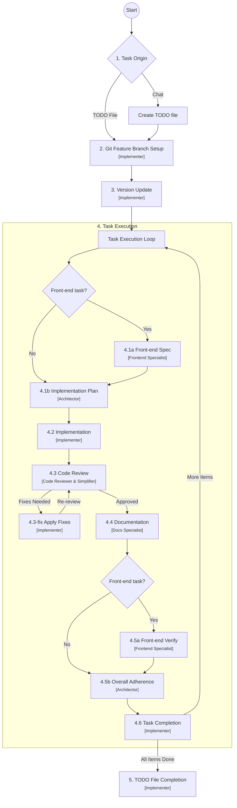

# Base Project for AI Agent Driven Development

This project serves as a foundational template for future AI-agent driven development. It is pre-configured with essential rules, workflows, and structures optimized for collaboration between human developers and AI agents (specifically Kilo Code and opencode).

**Attention AI Agents:** Before making any changes, you **must** read and adhere to the guidelines outlined in [`AGENTS.md`](AGENTS.md). This file contains critical information about the project's workflow, rules, and architectural standards.

## Table of Contents

- [Compatibility](#compatibility)
- [Prerequisites](#prerequisites)
- [About this Project](#about-this-project)
- [Project Structure](#project-structure)
- [The Critical Workflow](#the-critical-workflow)
- [Agent Models](#agent-models)
- [Getting Started (New Project Setup)](#getting-started-new-project-setup)
- [How to Start a Task](#how-to-start-a-task)
  - [Option 1: Using a TODO File (Recommended)](#option-1-using-a-todo-file-recommended)
  - [Option 2: Direct Chat Request](#option-2-direct-chat-request)
- [AI Agent Plans](#ai-agent-plans)
- [Troubleshooting](#troubleshooting)

## Compatibility

This template is **used on a daily basis with the Kilo Code VSCode plugin**, always running on its latest version (Kilo Code tested version > **7.4.22**).

Currently, the template is also **being tested with opencode**. For that purpose, opencode-specific settings were added to the project in [`.opencode/`](.opencode/), mainly the [`opencode.json`](.opencode/opencode.json) configuration file plus its own agent and command definitions. The rules are shared from `.kilo/rules/` — no duplication.

The project is developed with an [**opencode Go**](https://opencode.ai/go?ref=ZHA0GMN860) subscription (see the list below). In addition to the opencode Go models, the agent setup has also been tested with other model providers, such as **Grok**, **Gemini**, and **custom models hosted on vast.ai**.

This project should also work with:

- Kilo Code previous versions
- **Kilo Code CLI** (command-line interface)
- [**opencode Go**](https://opencode.ai/go?ref=ZHA0GMN860) — the premium opencode subscription this project is developed with
- Any AI agent manager or similar tool that supports custom sub-agent definitions, rule files, and workflow commands via markdown-based configuration

The project uses standard Markdown-based configuration (`.kilo/`, `.opencode/`, `.agent/`) and does not depend on any proprietary format, making it adaptable to other AI-driven development tools.

## Prerequisites

The only hard requirement is **Git**. On top of it, you need an AI agent handler tool to drive the project — **Kilo Code** and **opencode** are the two tools this template is tested with, but any similar app should work:

- **Git** — Required. Ensure your environment is configured for the workflow. See [`how-to-set-up-git.md`](docs/how-to-set-up-git.md).
- **Kilo Code** or **opencode** — the tested AI agent tools (VSCode plugin/CLI for Kilo Code; CLI for opencode). See the [Compatibility](#compatibility) section for details.
- **Any other AI agent handler app/software** — as long as it supports custom sub-agent definitions, rule files, and workflow commands via markdown-based configuration.

## About this Project

The primary goal of this repository is to provide a clean, structured starting point for new projects with built-in "AI-Readiness."

### Design Principles

- **Foundation**: A structured baseline for new repositories.
- **AI-Readiness**: Integrated configurations (like `.kilo`, `.agent`, and `.kilocodeignore`) to enable immediate and effective AI agent participation.
- **Standardization**: Established coding standards, workflows, and documentation practices.
- **Project Info**: A persistent context and knowledge management system for agents.

## Project Structure

Understanding the purpose of the configuration directories is key to effective development:

- [`.agent/`](.agent/): Stores project-specific agent context. Includes [`.agent/project-info/`](.agent/project-info/) for persistent project knowledge, the [`.agent/todos/`](.agent/todos/) directory for task tracking, and the [`project-structure.md`](.agent/project-structure.md) map. The core knowledge files (`brief.md`, `product.md`, `context.md`, `architecture.md`, `tech.md`) plus the behavior guide `instructions.md` live here; the project-specific ones are created during Project Info initialization (see below).
- [`.kilo/`](.kilo/): The operational core of the Kilo Code AI integration. Contains custom [`.kilo/agents/`](.kilo/agents/) (Planner, Architector, Implementer, Code Reviewer, Code Simplifier, Docs Specialist, Frontend Specialist, etc.), global [`.kilo/rules/`](.kilo/rules/) (22 rule files), standardized [`.kilo/commands/`](.kilo/commands/) (workflows like the Critical Workflow), and the [`.kilo/plans/`](.kilo/plans/) directory where agents store detailed implementation plans.
- [`.opencode/`](.opencode/): The operational core for **opencode** users. Contains [`.opencode/agents/`](.opencode/agents/) and [`.opencode/commands/`](.opencode/commands/) (the same agent/command definitions as `.kilo/`), configured via [`opencode.json`](.opencode/opencode.json). Rules are shared from `.kilo/rules/` — no duplication.
- [`.ignore`](.ignore): The opencode equivalent of `.kilocodeignore` — the same patterns (lock files, build outputs, media, etc.). It is the block list for the [`opencode-ignore`](https://github.com/lgladysz/opencode-ignore) plugin (registered in [`.opencode/opencode.json`](.opencode/opencode.json)), which blocks `read`/`edit`/`write`/`glob`/`grep`/`list` on matching files, and is also honored natively by opencode's search tools. `.env` reads are denied by default by opencode.
- [`.kilocodeignore`](.kilocodeignore): Controls which files are excluded from codebase indexing, skipping lock files, dependency directories, build outputs, and binary assets.

## The Critical Workflow

The project follows a standardized process for task execution, ensuring systematic progress from analysis to deployment. Each step is handled by a dedicated sub-agent:



For full details, see [`critical-workflow.md`](.kilo/commands/critical-workflow.md).

## Agent Models

The sub-agents in this project are **model-agnostic**: you can assign a different AI model to each agent in your tool's UI. Using different models per agent produces noticeably better results than running every role on a single model, because each agent can be matched to the strengths its task demands.

A recommended starting point, balancing quality and cost:

- **Reasoning-heavy roles** — [Planner](.kilo/agents/planner.md), [Architector](.kilo/agents/architector.md), [Code Reviewer](.kilo/agents/code-reviewer.md), [Frontend Specialist](.kilo/agents/frontend-specialist.md): use the strongest available model (e.g., a Claude Sonnet/Opus-class model) for analysis, planning, and quality judgment.
- **Execution roles** — [Implementer](.kilo/agents/implementer.md), [Code Simplifier](.kilo/agents/code-simplifier.md), [Docs Specialist](.kilo/agents/docs-specialist.md): use a fast, capable model (e.g., a Claude Haiku-class model) for the well-defined steps coming from the plan.

The workflow and sub-agent prompts are model-independent, so you can tune each agent's model freely to your preferences and budget.

## Getting Started (New Project Setup)

1. **Write the project brief** — Define the project's core requirements and scope in `.agent/project-info/brief.md`. AI agents rely on it for context across sessions; if it's not defined, agents may produce work that does not align with your goals.
2. **Set up Git** — Configure Git for the workflow and store your credentials. See [`how-to-set-up-git.md`](docs/how-to-set-up-git.md).
3. **Initialize project info** — Ask the planner agent to read the brief and initialize the project info, either by creating a TODO file as described in [Option 1: Using a TODO File (Recommended)](#option-1-using-a-todo-file-recommended), or by typing the request directly in the chat as described in [Option 2: Direct Chat Request](#option-2-direct-chat-request).

4. **Work with the planner** — From now on, just ask the planner agent to work through TODO files, or include tasks directly in the chat. See [How to Start a Task](#how-to-start-a-task).

> **Note on Project Info:** When cloning this template for a new project, the Project Info initialization workflow triggers automatically (it detects the `.agent/project-info/.initialized` marker file). The file `.agent/project-info/brief.md` defines the project's core requirements and scope — AI agents rely on it for context across sessions. To initialize, run `/critical-workflow` and ask to "initialize project info". See [`.kilo/commands/project-info-init.md`](.kilo/commands/project-info-init.md) for details. If the project brief is not defined, agents may produce work that does not align with your goals.

## How to Start a Task

To initiate work with an AI agent, use one of the following copy-paste friendly commands in the chat.

> **Note:** The same chat templates below work in both Kilo Code and opencode. opencode loads the `/critical-workflow`, `/project-info-init`, and `/project-structure` commands from `.opencode/commands/`.

### Option 1: Using a TODO File (Recommended)

1. Create a new file named `YYYYMMDD-todo-X.md` inside a date-specific subdirectory under `.agent/todos/` (e.g., `.agent/todos/20260602/20260602-todo-1.md`).
2. Populate it using one of the [recommended TODO file formats](docs/how-to-write-todo-files.md).
3. Paste the following into the chat:

```text
full read @AGENTS.md & follow /critical-workflow
do @/.agent/todos/<YYYYMMDD>/<YYYYMMDD>-todo-<number>.md
```

### Option 2: Direct Chat Request

If you have a quick request, use this template:

```text
full read @AGENTS.md & follow /critical-workflow
do [Your specific task or request here]
```

## AI Agent Plans

The critical workflow requires the AI to generate detailed implementation plans for each task. The [Architector sub-agent](.kilo/agents/architector.md) handles analysis and planning (step 4.1b), while the [Implementer sub-agent](.kilo/agents/implementer.md) executes the plan (step 4.2). A [Code Reviewer](.kilo/agents/code-reviewer.md) and [Code Simplifier](.kilo/agents/code-simplifier.md) validate quality, a [Docs Specialist](.kilo/agents/docs-specialist.md) maintains documentation, and a [Frontend Specialist](.kilo/agents/frontend-specialist.md) produces front-end specs (4.1a) and verifies front-end implementations (4.5a) for front-end related tasks.

The AI agent will ask for your approval before proceeding with plans. To skip approval prompts, include in the TODO file or chat request:

```text
"Don't request me to approve plans"
```

> **Note:** Agents generate many plan and/or report files (e.g., under `.kilo/plans/`) during the workflow. In addition to the TODO files, the amount of these "type" of files grows fast. You may delete, archive, or zip them at any time if they bother you.

## Troubleshooting

### MCP Tools (Bifrost, vscode-mcp-server)

Some project files reference MCP tools such as `Bifrost_*` and `vscode-mcp-server_*` (e.g., in [`.kilo/rules/tool-selection-priority.md`](.kilo/rules/tool-selection-priority.md)). These are **MCP plugin types**: they are not bundled with this project — you must install and configure the corresponding MCP servers in **VSCode** for them to be available to the agents.

This should not generate problems, because the mentioned rule is environment-adaptive: when those MCP tools are not exposed in the current environment, agents fall back to the built-in tools. However, if you do find issues caused by these declarations, you can simply edit or remove them in [`.kilo/rules/tool-selection-priority.md`](.kilo/rules/tool-selection-priority.md).

---

*Note: This workflow is actively maintained and updated to improve stability and introduce new features.*
